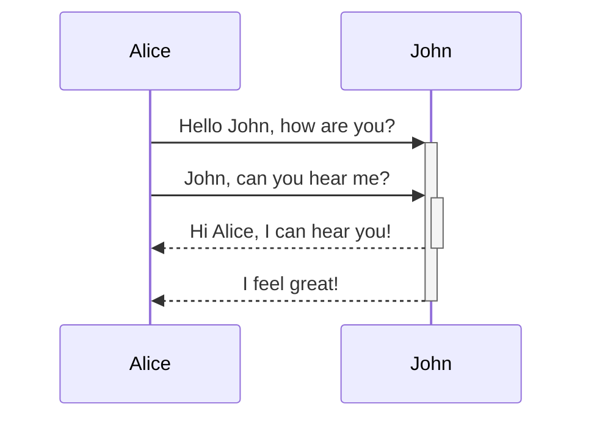
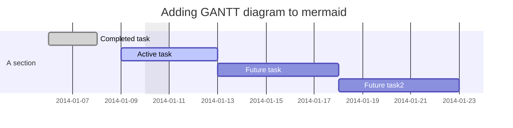

### Mermaid Diagrams

<pre><code>```mermaid
sequenceDiagram
    Alice->>+John: Hello John, how are you?
    Alice->>+John: John, can you hear me?
    John-->>-Alice: Hi Alice, I can hear you!
    John-->>-Alice: I feel great!
```</code></pre>



## Gant Chart
<pre><code>```mermaid
gantt  
dateFormat  YYYY-MM-DD  
title Adding GANTT diagram to mermaid  
excludes weekdays 2014-01-10  
  
section A section  
Completed task            :done,    des1, 2014-01-06,2014-01-08  
Active task               :active,  des2, 2014-01-09, 3d  
Future task               :         des3, after des2, 5d  
Future task2              :         des4, after des3, 5d
```</code></pre>


